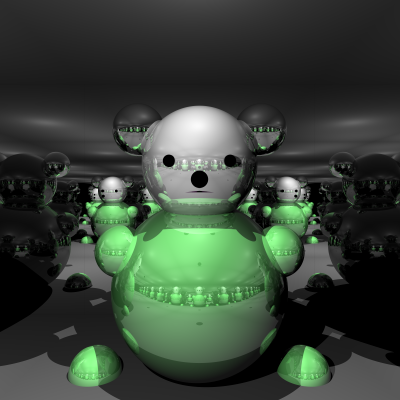

# COMP30019 - Project 1 - Ray Tracer

This is your README.md... you should write anything relevant to your
implementation here.

Please ensure your student details are specified below (*exactly* as on UniMelb
records):

**Name:** Elizabeth Wong \
**Student Number:** 1082634 \
**Username:** wonges \
**Email:** wongesstudent.unimelb.edu.au

## Completed stages

Tick the stages bellow that you have completed so we know what to mark (by
editing README.md). **At most 9** marks can be chosen in total for stage
three. If you complete more than this many marks, pick your best one(s) to be
marked!

<!---
Tip: To tick, place an x between the square brackes [ ], like so: [x]
-->

##### Stage 1

- [x] Stage 1.1 - Familiarise yourself with the template
- [x] Stage 1.2 - Implement vector mathematics
- [x] Stage 1.3 - Fire a ray for each pixel
- [x] Stage 1.4 - Calculate ray-entity intersections
- [x] Stage 1.5 - Output primitives as solid colours

##### Stage 2

- [x] Stage 2.1 - Diffuse materials
- [x] Stage 2.2 - Shadow rays
- [x] Stage 2.3 - Reflective materials
- [x] Stage 2.4 - Refractive materials
- [x] Stage 2.5 - The Fresnel effect
- [x] Stage 2.6 - Anti-aliasing

##### Stage 3

- [ ] Option A - Emissive materials (+6)
- [ ] Option B - Ambient lighting/occlusion (+6)
- [ ] Option C - OBJ models (+6)
- [x] Option D - Glossy materials (+3)
- [ ] Option E - Custom camera orientation (+3)
- [ ] Option F - Beer's law (+3)
- [ ] Option G - Depth of field (+3)

*Please summarise your approach(es) to stage 3 here.*
In order to create a glossy looking surface I used diffussion but meshed it with
a bit of reflection and scaled it's intensity up in hopes to mimick a glossy surface.
I tried to do custom camera but didn't have time to work out the camera axis :(
## Final scene render

Be sure to replace ```/images/final_scene.png``` with your final render so it
shows up here.



This render took  **1** hour **46** minutes and **34** seconds on my PC.

I used the following command to render the image exactly as shown:

```
dotnet run -- -f tests/final_scene.txt -o final_scene.png -x 32
```

## Sample outputs

We have provided you with some sample tests located at ```/tests/*```. So you
have some point of comparison, here are the outputs our ray tracer solution
produces for given command line inputs (for the first two stages, left and right
respectively):

###### Sample 1

```
dotnet run -- -f tests/sample_scene_1.txt -o images/sample_scene_1.png -x 4
```

<p float="left">
  
   
</p>

###### Sample 2

```
dotnet run -- -f tests/sample_scene_2.txt -o images/sample_scene_2.png -x 4
```

<p float="left">
  
   
</p>

## References

*You must list any references you used - add them here!* \
Sphere Primitive Intersection: https://www.scratchapixel.com/lessons/3d-basic-rendering/minimal-ray-tracer-rendering-simple-shapes/ray-sphere-intersection \
Triangle Primitive Intersection: https://www.scratchapixel.com/lessons/3d-basic-rendering/ray-tracing-rendering-a-triangle/ray-triangle-intersection-geometric-solution \
Reflection Handeling: https://www.scratchapixel.com/lessons/3d-basic-rendering/introduction-to-shading/reflection-refraction-fresnel \
COMP30019 Project 1 Spec Stage 1.5 https://canvas.lms.unimelb.edu.au/courses/126656/assignments/315540?module_item_id=3943284 \
COMP30019 Lecture 4  https://canvas.lms.unimelb.edu.au/courses/126656/pages/lecture-4-rasterising-and-ray-tracing?module_item_id=3943245 \
Refraction Handeling + Freshnals: https://www.scratchapixel.com/code.php?id=13&origin=/lessons/3d-basic-rendering/introduction-to-shading \

I mainly used the ScratchaPixel website to reference the maths behind how intersections and each material color technique 
worked then applied them to my ray tracer. The lecture was very helpful towards normalising the pixel space.